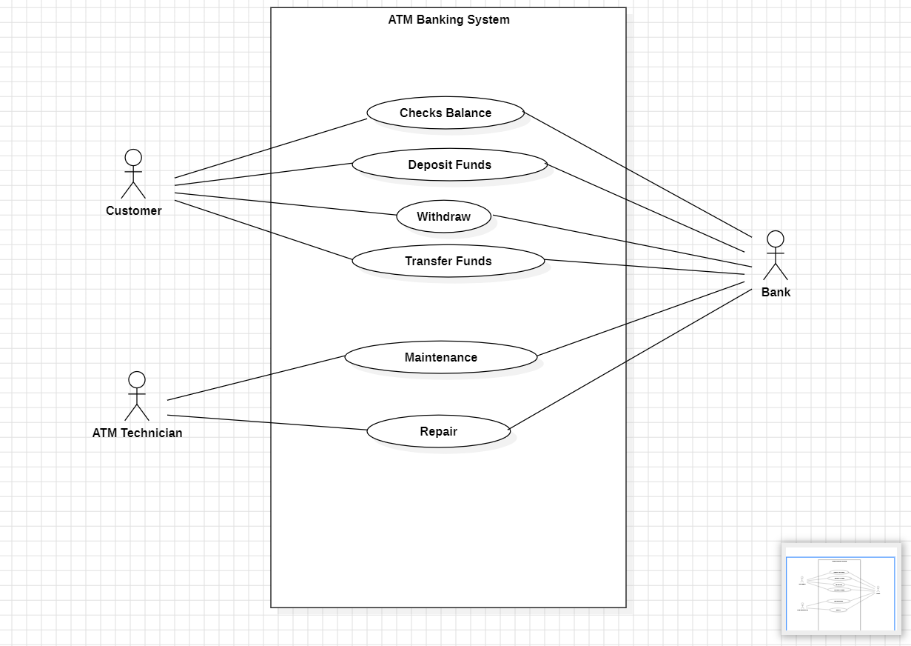
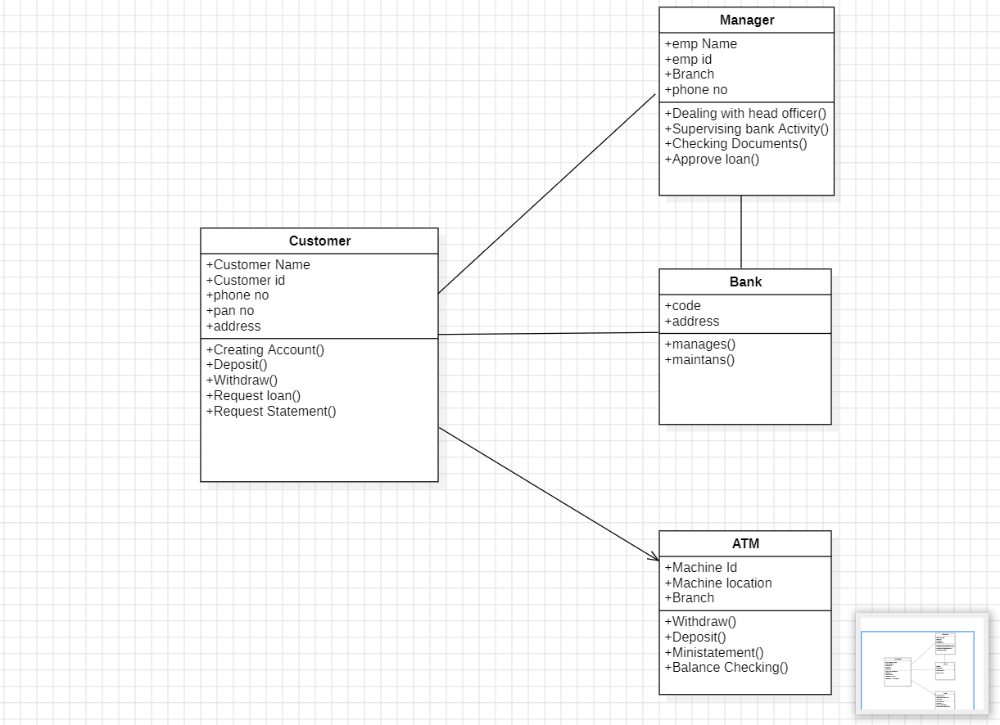
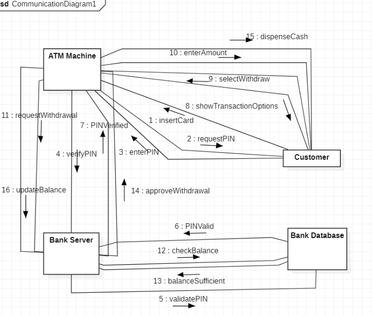
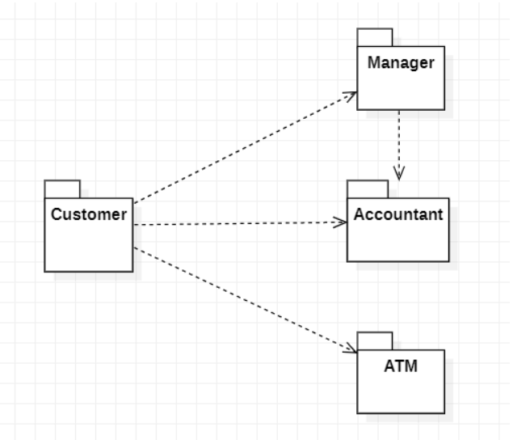
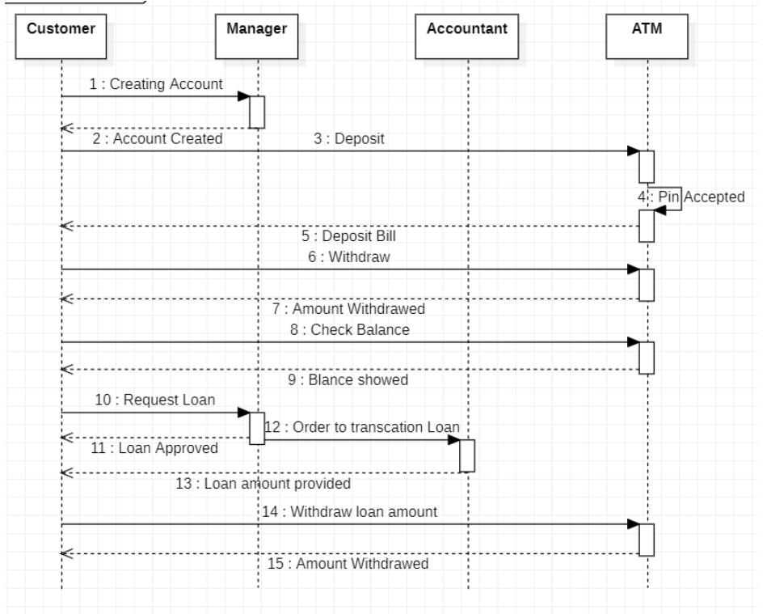

# ATM-AND-BANKING-SYSTEM
# Reg No:212224230177
# Name:NARENDHIRAN P
# Date:13.09.2025


# AIM:
To develop the ATM and Banking System using Star UML

# Problem Statement:
1.Banks need to provide fast, secure, and self-service access to basic banking functionalities.

2.Manual banking for simple tasks (like cash withdrawal or balance inquiry) leads to long queues and inefficient use of bank staff.

3.There is a lack of consistent and secure user authentication in some older systems.

4.Existing ATM systems may not be user-friendly or may lack multilingual support.

5.Customers require 24/7 access to basic banking services without depending on bank working hours.

6.A reliable ATM software system is needed to:

7.Allow users to securely access their accounts using ATM cards and PIN.

8.Enable operations like cash withdrawal, balance inquiry, mini statement printing, and PIN change.

9.Ensure real-time processing and data consistency with the core banking system.

10.Provide a simple and intuitive user interface.


# UML DIAGRAMS

# USE CASE DIAGRAM


A use case diagram is a graphical depiction of a user's possible interactions with a system. The use cases are represented by either circles or ellipses. The actors are often shown as stick figures.

UML is the modeling toolkit that you can use to build your diagrams. Use cases are represented with a labeled oval shape.

Stick figures represent actors in the process, and the actor's participation in the system is modeled with a line between the actor and use case.
 
 ```USE CASE DIAGRAM```


# UML use case diagrams are ideal for:

Representing the goals of system-user interactions

Defining and organizing functional requirements in a system

Specifying the context and requirements of a system

→ Modeling the basic flow of events in a sina use case.


# CLASS DIAGRAM

The Unified Modeling Language (UML) can help you model systems in various ways. One of the more popular types in UML is the class diagram. Popular

among software engineers to document software architecture, class diagrams are a type of structure diagram because they describe what must be present in the system being modeled. No matter your level of familiarity with UML or class diagrams, our UML software is designed to be simple and easy to use.

Class diagrams offer a number of bend is for any organization. Use UML class diagrams to:

Better understand the general overview of the schematics of an application.

Visually express any specific needs of a system and disseminate that information throughout the business.

Create detailed charts that…

```CLASS DIAGRAM```
 

 


# COMMUNICTION DIAGRAM:

A communication diagram offers the same information as a sequence diagram, but while a sequence diagram emphasizes the time and order of events, a communication diagram emphasizes the messages exchanged between objects in an application. Sequence diagrams can fall short of offering the "big picture."

Communication diagrams offer benefits similar to sequence diagrams, but they will offer a better understanding of how components communicate and interact with each other rather than solely emphasizing the sequence of events. They can be a useful reference for businesses, organizations, and engineers who need to visualize and understand the physical communications within a program. Try drawing a sequence diagram to:

```COMMUNICATION DIAGRAM```




# PACKAGE DIAGRAM:

Package diagrams are structural diagrams used to show the organization and arrangement of various model elements in the form of packages. A package is a grouping of related UML elements, such as diagrams, documents, classes, or even other packages. Each element is nested within the package, which is depicted as a file folder within the diagram, then arranged hierarchically within the diagram. Package diagrams are most commonly used to provide a visual

organization of the layered architecture within any UML classifier, such as a software system.

A well-designed package diagram provides numerous benefits to those looking to create a visualization of their UML system or project.

```PACKAGE DIAGRAM```




# ACTIVITY DIAGRAM:

The Unified Modeling Language includes several subsets of diagrams, including structure diagrams, interaction diagrants, and behavior diagrams. Activity diagrams, along with use case and state machine diagrams, are considered behavior diagrams because they describe what must happen in the system being modeled.

Stakeholders have many issues to manage, so it's important to communicate with clarity and brevity. Activity diagrams help people on the business and development sides of an organization come together to understand the same process and behavior.

Activity diagrams present a number of benefits to users. Consider creating an activity diagram to:

Demonstrate the logic of an algorithm.

Describe the steps performed in a UML use case.

```ACTIVITY DIAGRAM```


# SEQUENCE DIAGRAM

A sequence diagram is a type of intera jon diagram because it describes how- and in what order a group of objects works together. These diagrams are used by software developers and business professionals to understand requirements for

a new system or to document an existing process. Sequence diagrams are sometimes known as event diagrams or event scenarios.

```SEQUENCE DIAGRAM```



# BENEFITS OF SEQUENCE DIAGRAM

Sequence diagrams can be useful references for businesses and other organizations. Try drawing a sequence diagram to:

Represent the details of UML use cases.

Model the logic of a sophisticated procedure, function, or operation. See how objects and components interact with each other to complete a process.

Plan and understand the detailed functionality of an existing or future scenario.


# RESULT

Thus the project to develop ATM and Banking system was developed using Star UML Software is done successfully.

